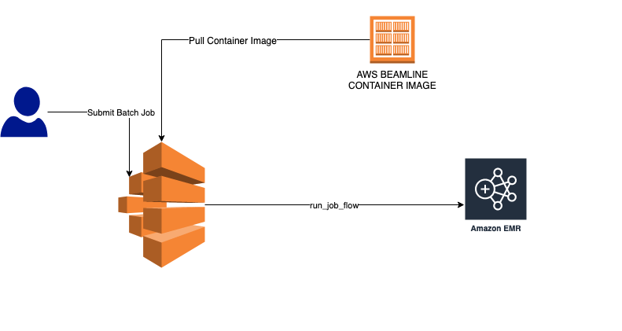

# AWS Beamline(Beta)
AWS Beamline is a open source library(prototype) that makes it easy for customers to build big data pipelines using Amazon EMR. It abstracts out the complexity of infrastructure management for users who want to execute either Spark SQL or Pyspark job on top of EMR. Under the hood, AWS Beamline uses the EMR APIs to spin up EMR clusters on your behalf.  

# How it works?

1. Beamline is driven by a config file similar to `awsbeamline/config/emr.yaml`
2. This config file defines different cluster sizes under a `default` namespace
3. Each cluster has a T-Shirt size that defines the size of the worfload
4. Beamline user may want to modify this file to define their own naming convension for cluster sizing.
5. A job definition is defined in a yaml file. Example:  `aws-beamline/awsbeamline/config/examples/job_definition/spark_sql.yaml` 
6. For simplicity(for the prototype), the job configs are being stored in S3. However, additional integration can be defined to get the job configs from version control repositories like Github. 

Note: `spec>>compute>>size` parameter needs to match  with one of the T-Shirt sizes defined in `emr.yaml`

# Deployment architecture

# CLI Usage

	python beamline.py execute_task_instance -h

	usage: beamline.py [-h] [-n PROFILE_NAME] [-c CONFIG_FILE] [-d RUN_DATE]
	                   [-f RUN_DATE_FORMAT]

	Execute task instance in client mode

	optional arguments:
	  -h, --help            show this help message and exit
	  -n PROFILE_NAME, --name PROFILE_NAME
	                        Task profile name
	  -c CONFIG_FILE, --config-file CONFIG_FILE
	                        Task config file in S3
	  -d RUN_DATE, --rundate RUN_DATE
	                        Run date for task instance.
	  -f RUN_DATE_FORMAT, --rundateformat RUN_DATE_FORMAT
	                        Run date format in unix format for task instance.